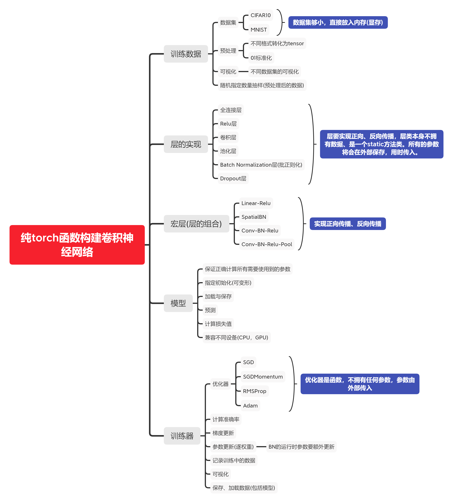

# ConvNetFromScratch

使用**纯torch函数**复现卷积神经网络。

**No torch.nn! No torch.nn!**

实现了以下功能:

- 全连接层
- 朴素卷积层、高速卷积层
- MaxPool层
- Batch Normalization层
- Dropout层
- 所有层的正向传播和反向传播
- 梯度更新
- 多种优化器(SGD，SGDMomentum，RMSprop，Adam)
- 普通正态分布初始化方法、Kaiming(He)初始化方法
- 训练历史数据可视化、保存和加载
- 模型保存和加载
- 下载CIFAR10数据集并预处理
- 在CIFAR10数据集上训练
- 可视化CIFAR10结果(ipynb)
- 下载Mnist数据集并预处理
- 在Mnist数据集上训练
- 绘制数字并送入网络识别(ipynb)

ps:

1.卷积层优化采用im2col、col2im算法，但是稍作修改；

2.mnist上取得98%+准确率，CIFAR10上取得82%+准确率(其实可以用较深的网络训练，为了降低开销只训练了一个小网络)

3.可以轻易的构建带有BN和Dropout的VGGNet(有把各种层组合好的类)。

如果您觉得有用，不如给我点个免费的star，谢谢！

